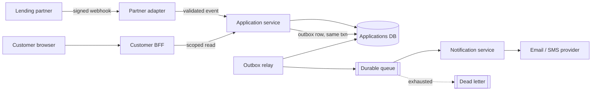

# Production design

How I would grow this exercise into a production system, and what I would
postpone.

## Boundaries

Three services, because they have three different failure profiles:

- **Partner adapter** - the only thing that trusts partner input. Verifies the
  signature, validates the schema, owns no data. Today this is `requirePartner`
  + `validateBody`, which is why they are named guards rather than inline code.
- **Application service** - owns application state and history, and is the only
  writer to them. Everything else reads through its API.
- **Notification service** - owns delivery, absorbs provider outages, and is the
  only component allowed to be slow.

Each service owns its own tables. Nobody reaches across a boundary into another
service's data.

## Idempotency and ordering

- **Idempotency key** is the partner's `eventId`, enforced by a unique
  constraint - already implemented. The constraint is the guarantee; the
  preceding read only makes the common case cheap. A collision means "already
  applied", which is success, not an error.
- Extend outward: every write endpoint takes an idempotency key, and provider
  calls carry one, so a crash between "provider accepted" and "we recorded it"
  cannot double-send.
- **Timestamps are not an ordering.** Clocks drift and two events can share a
  millisecond. I would ask the partner for a monotonic per-application sequence
  number and order on `(sequence, occurredAt)`, keeping the compare-and-set
  write so a late event can never overwrite newer state.
- **Late but valid events** would be recorded in history marked *superseded*
  rather than discarded. Losing evidence is worse than storing an out-of-order
  fact. Current state still follows the newest event.

## Retries and dead letters

- Exponential backoff with jitter, a per-job attempt cap, `next_attempt_at`
  persisted so a restart does not reset the schedule.
- Separate retryable (timeout, 5xx, rate limit) from terminal (invalid address,
  hard bounce); stop immediately on the latter.
- Exhausted jobs move to an explicit `DEAD_LETTERED` state keeping the last
  error - not deleted, not silently marked done. Operators need a list, a reason
  per item, and a replay action that is itself idempotent.
- Workers claim rows with a conditional update and a visibility timeout, so two
  workers cannot take the same job and a dead worker releases its claim by
  expiry.

This is the largest gap in the current code (ISSUES.md #9, #10).

## Authorization and sensitive data

Two trust boundaries, deliberately not shared. Both live behind named guards, so
replacing them touches one file.

- **Customers** - a real session (OIDC), short-lived token, `customer_id` from
  the verified token and never from a header. Ownership stays enforced *in the
  query*: a guard can be forgotten on the next route added, a scoped query
  cannot silently return somebody else's row.
- **Partner** - mTLS or a signed webhook with a replay window, IP allowlist,
  network isolation from the public API, rotatable credentials.
- **Internal** - service-to-service identity, least privilege per service.

Contact details and amounts are personal data: encrypt at rest and in transit,
keep PII out of logs and metrics (already applied), mask in any operator UI and
require a reason to unmask, enforce retention and deletion.

## Auditability

History is append-only and treated as evidence, so it must answer "who changed
this, when, and on whose say-so" months later.

- Keep the partner's `occurredAt` **and** our `recorded_at` - business time and
  system time answer different questions during an incident.
- Add the request id, the adapter version, and a hash of the raw partner payload.
- No updates and no deletes. A correction is a new compensating entry.
- Separately, log who read which application - that is itself auditable.

## Observability

Optimise for one question: *why did this customer not get their email?*

- **Correlation** - one id flowing partner request → API log → outbox row → job
  → provider call. Its absence is the main reason the current system is hard to
  diagnose.
- **Metrics** - events by outcome; queue depth and oldest pending job; delivery
  success and latency by provider; dead-letter count.
- **Alerts that mean something** - dead letters rising, oldest pending job past
  threshold, invalid-transition rate spiking (a partner contract change),
  duplicate rate spiking (a retry storm).

## Deployment, migration, rollback

- **Migrations** versioned and reviewed (`prisma migrate`), applied as a deploy
  step, never on service start. The exercise uses `db push`, which has no
  history and therefore no rollback.
- **Expand/contract for every schema change** - add nullable, backfill,
  dual-write, switch reads, then drop. The unique constraints added here are the
  awkward case: adding one can fail on existing duplicates, so in production it
  is add-index-concurrently, verify, then enforce.
- **Rollback** of code is a redeploy of the previous image. Data rollback
  usually is not available, which is exactly why every migration must leave the
  previous version of the code able to run.
- **Compatibility** - version the partner contract; never remove a response
  field without a deprecation window.

## Tradeoffs

**Taken here.**

- *Correctness over throughput* - an extra read and a transaction per event. At
  this volume that is free, and it buys a guarantee.
- *Rejecting stale events rather than recording them as superseded* - simpler
  now, less evidence later. First thing I would revisit.
- *Uniqueness scoped per application* - safer against a partner reusing
  counters; a global constraint would catch more.
- *The lifecycle exactly as documented*, even where a wider one seems plausible.
  Guessing at business rules is how silent bugs ship.

**Postponed, in order.** Worker retry and dead letters → worker row claiming →
real authentication both sides → migrations → splitting the services.

The split is last on purpose. These boundaries are worth *designing* now and not
worth *deploying* until load or team structure demands it - a premature split
turns one transaction into a distributed one, a much harder problem than the one
it solves.
